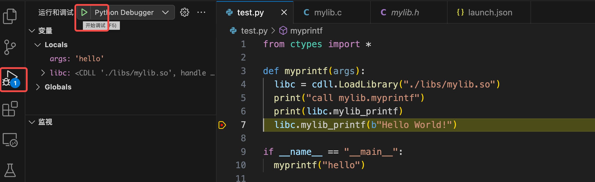
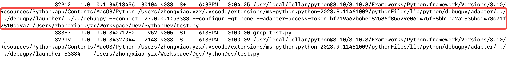
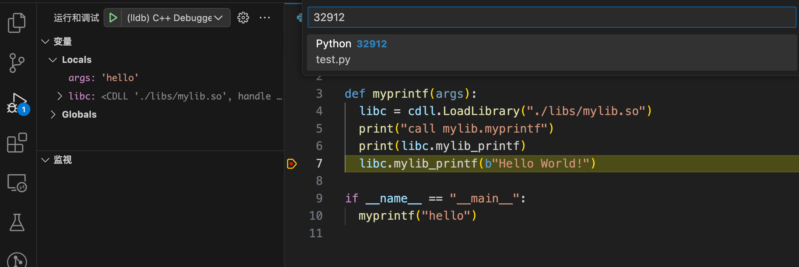
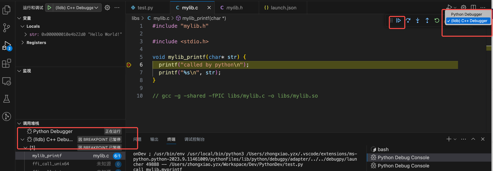

# Debugging Python with C Extension

There are many blogs to guide developers to debug python with c extension, but all those ways are still unavaible even with the vscode plugin "Python C++ Debugger". Finally, we discover that the following way is availble for debugging python with c extension.

## Debugging Examples

### test.py
``` python
# test.py
from ctypes import *

def myprintf(args):
  libc = cdll.LoadLibrary("./libs/mylib.so")  
  print("call mylib.myprintf")
  print(libc.mylib_printf)
  libc.mylib_printf(b"Hello World!")

if __name__ == "__main__":
  myprintf("hello")

```

### mylib.c
```
// gcc -g -shared -fPIC libs/mylib.c -o libs/mylib.so

#include "mylib.h"

#include <stdio.h>

void mylib_printf(char* str) {
  printf("called by python\n");
  printf("%s\n", str);
}
```

## Debugging "Python + C"
### Configure "launch.json"
In the launch.json, "(lldb) C++ Debugger" used for C/C++ debugging; "Python Debugger" used for Python debugging.
```
{
  // 使用 IntelliSense 了解相关属性。 
  // 悬停以查看现有属性的描述。
  // 欲了解更多信息，请访问: https://go.microsoft.com/fwlink/?linkid=830387
  "version": "0.2.0",
  "configurations": [
    {
      "name": "(lldb) C++ Debugger",
      "type": "cppdbg",
      "request": "attach",
      "program": "/usr/local/bin/python3",
      "MIMode": "lldb"
    },
    {
      "name": "Python Debugger",
      "type": "python",
      "request": "launch",
      "program": "${file}",
      "console": "integratedTerminal",
      "justMyCode": true
    }
  ]
}

```
### Python Debugging
In vscode, we can follow the steps in the following figure to debugging the python.


### C++ Debugging
As show in "Python Debugging", we stop the program in python, then, we can find the pid for "python debugging process" with conmmand `ps aux| grep test.py`


When we get the pid, we can start the debugging with `lldb -p 32912` or start vscode "(lldb) C++ Debugger"


After attaching to python process pid, we can jump into the C/C++ source files, so we can debugging the C/C++ source files as normal.


# Reference
[1]. Example debugging mixed Python C++ in VS Code: https://nadiah.org/2020/03/01/example-debug-mixed-python-c-in-visual-studio-code/

