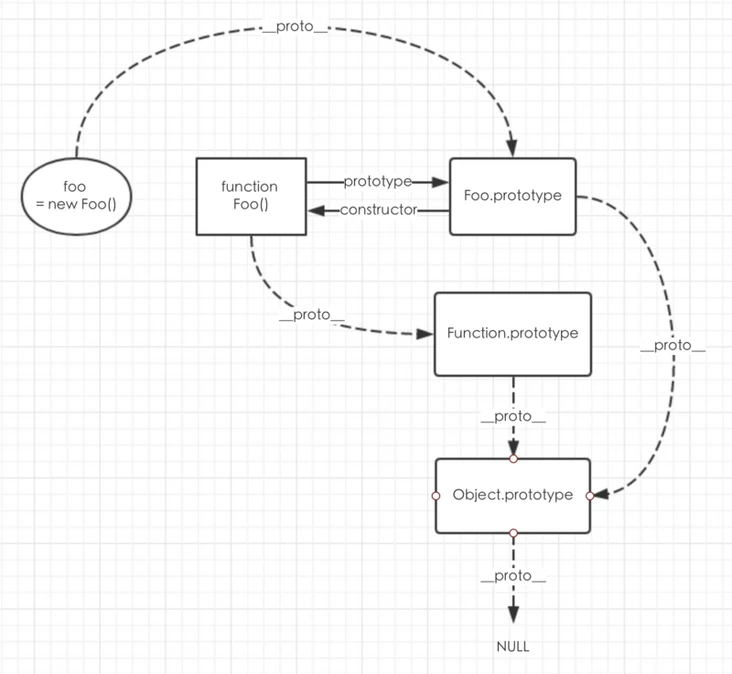

# Javascript Spec

## 1. "prototype" vs "__proto__"
### prototype

prototype是一个拥有 [[Construct]] 内部方法的对象才有的属性。
例如函数，对象的方法，ES6 中的类。注意 ES6 中的箭头函数没有 [[Construct]] 方法，因此没有prototype这个属性，除非你为它添加一个。
当创建函数时，JavaScript 会为这个函数自动添加prototype属性，这个属性指向的是一个原型对象Functionname.prototype。我们可以向这个原型对象添加属性或对象，甚至可以指向一个现有的对象。

### __proto__
接下来我们说说继承，每个对象都有一个__proto__属性，这个属性是用来标识自己所继承的原型。
注意： JavaScript 中任意对象都有一个内置属性 [[Prototype]] ，在ES5之前没有标准的方法访问这个内置属性，但是大多数浏览器都支持通过__proto__来访问。以下统一使用__proto__来访问 [[Prototype]]，在实际开发中是不能这样访问的。

### 原型链
JavaScript 可以通过prototype和__proto__在两个对象之间创建一个关联，使得一个对象就可以通过委托访问另一个对象的属性和函数。
这样的一个关联就是原型链，一个由对象组成的有限对象链，用于实现继承和共享属性。

JavaScript 函数有两个不同的内部方法：[[Call]] 和 [[Construct]] 。
如果不通过new关键字调用函数，则执行 [[Call]] 函数，从而直接执行代码中的函数体。
当通过new关键字调用函数时，执行的是 [[Construct]] 函数，它负责创建一个实例对象，把实例对象的__proto__属性指向构造函数的prototype来实现继承构造函数prototype的所有属性和方法，将this绑定到实例上，然后再执行函数体。

至此我们了解了prototype和__proto__的作用，也了解使用构造函数创建对象实例时这两个属性的指向，以下使用一张图来总结一下如何通过prototype和__proto__实现原型链。

## Reference
https://segmentfault.com/a/1190000011801127
https://www.zhihu.com/question/34183746