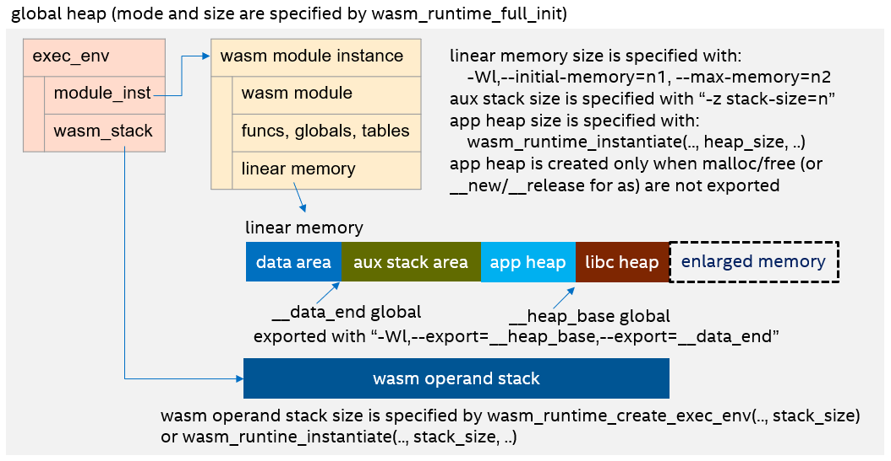
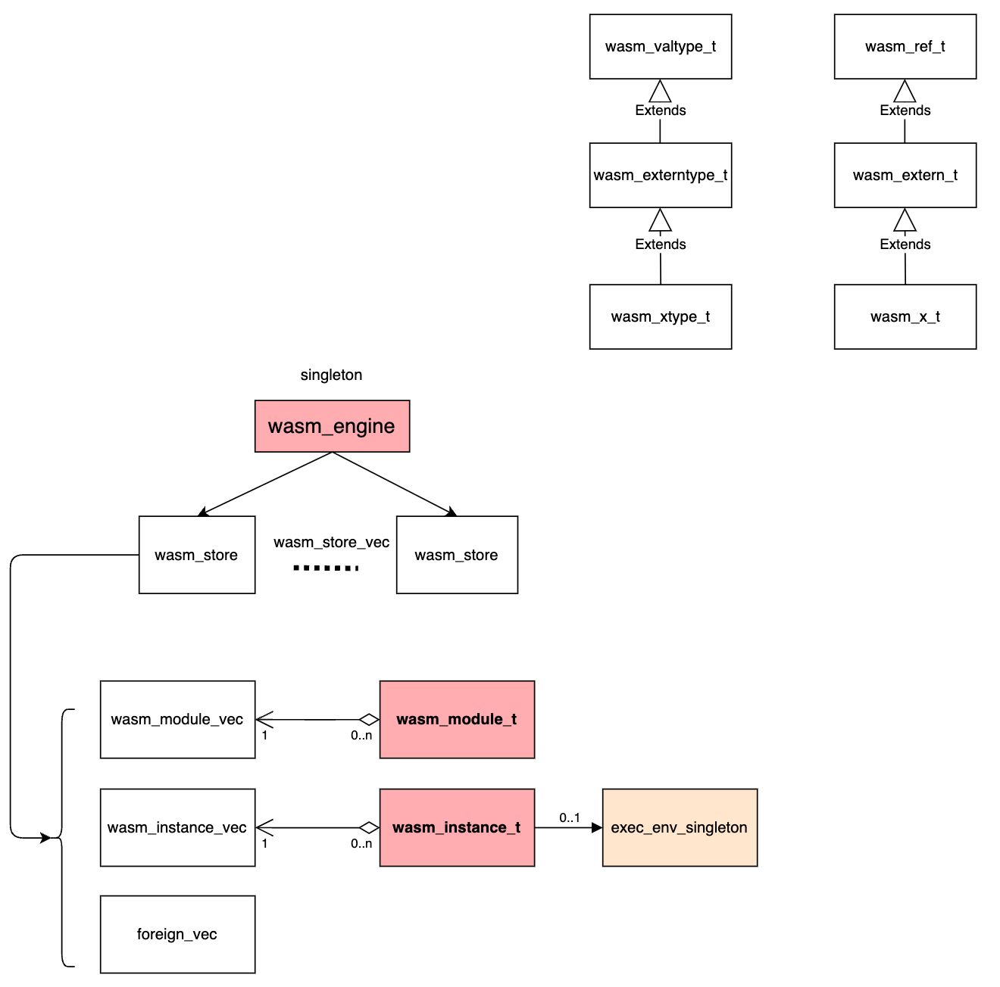
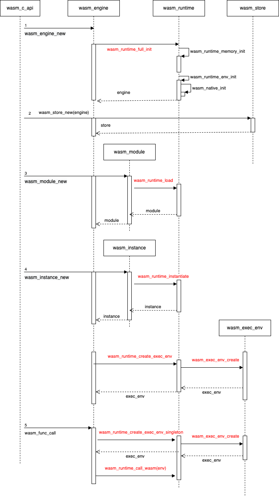
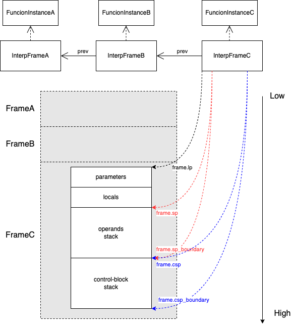

# WAMR 架构与源码分析

## WAMR内存模型
https://github.com/bytecodealliance/wasm-micro-runtime/blob/main/doc/memory_tune.md

## WAMR Runtime Architecture

## Reference
[1] A fast WebAssembly Interpreter design in WASM-Micro-Runtime
https://www.intel.com/content/www/us/en/developer/articles/technical/webassembly-interpreter-design-wasm-micro-runtime.html

