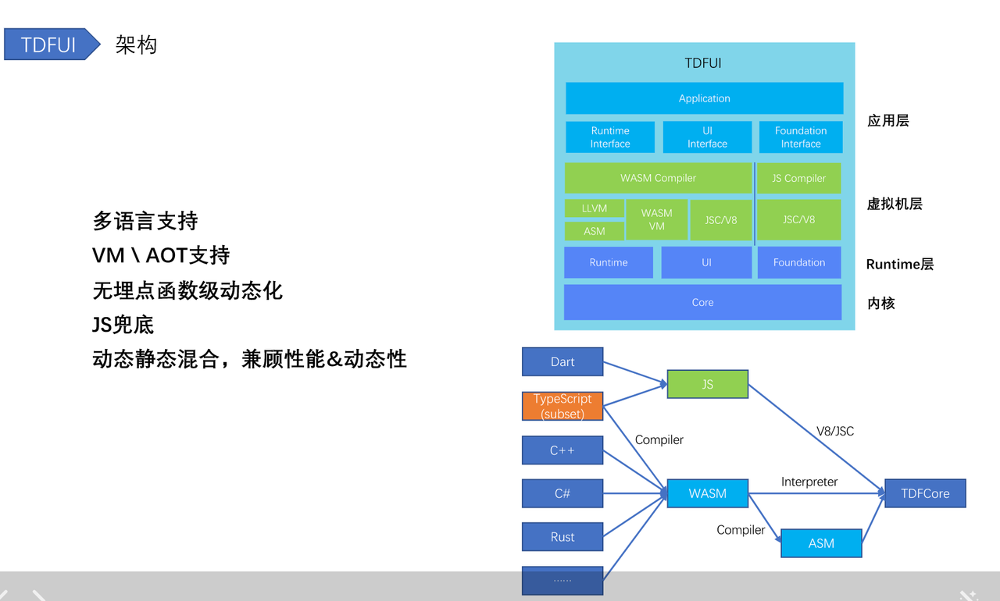
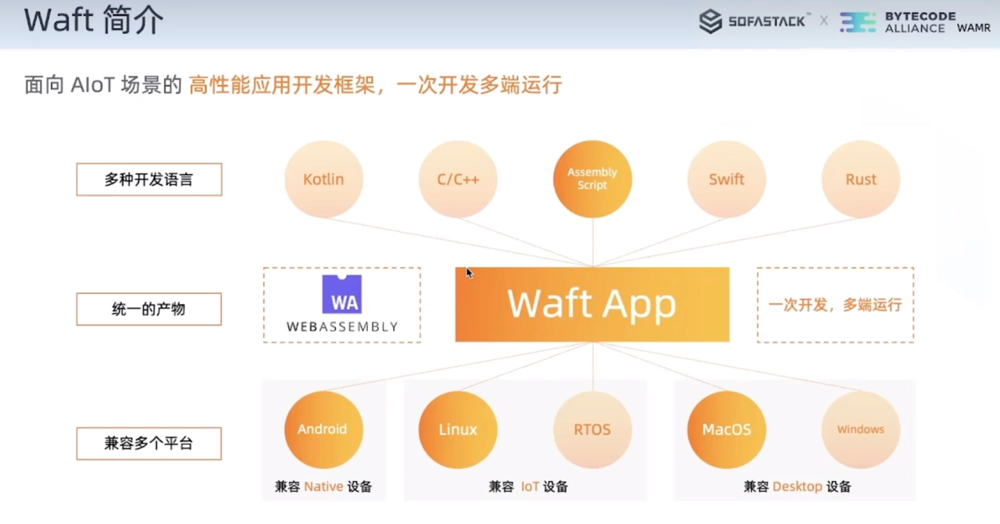

# 基于 Wasm 动态化跨端框架

| 生态         | 框架        | 主要语言/环境 |    平台      |
| ----------- | ----------- | ----------- | ----------- |
| 前端      | React Naitve/weex| JS        | Android/iOS/Web|
|          | Electron        |   JS       | 桌面应用 |
|          | 微信小程序       |  WXML,WXSS, JS| 微信，QQ|
|          | Web            | HTML,CSS, JS |  浏览器  |
| Native   | Flutter        | Dart         | Adnroid, iOS, Web, 桌面|
|          | QT           | C++          | 桌面，嵌入式|
|           | Xamarin      | C++         | Android, iOS, macOS|
| Wasm     |  天猫精灵 waft |  WASM          |  IOT
|          |  TDFUI        |  WASM          |  IOT
|          |  小米          |  WASM          |  IOT

## 1. TDF(Tencent Dynamic Framework)
从0开始，打造腾讯自研的跨端&动态化框架
https://tool.lu/en_US/deck/vt/detail?slide=29

## 2. Waft
https://chuangke.aliyun.com/waft

## Reference
https://zhuanlan.zhihu.com/p/609480548?utm_campaign=shareopn&utm_medium=social&utm_oi=745961534215184384&utm_psn=1613968662758727680&utm_source=wechat_session&utm_id=0