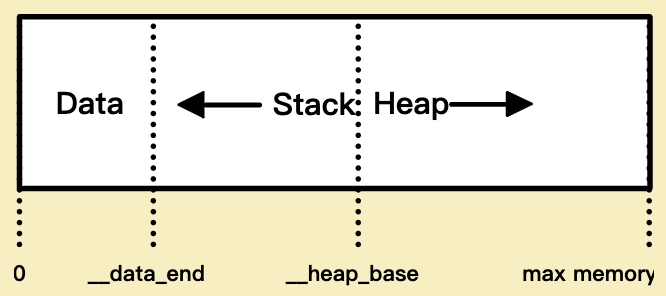

# WebAssembly

## Memory [2][3][4]

The stack grows downwards and the heap grows upwards. The stack starts at __data_end, the heap starts at __heap_base. Because the stack is placed first, it is limited to a maximum size set at compile time, which is __heap_base - __data_end.

If we look back at the globals section in our WAT we can find these symbols defined. __heap_base is 66560 and __data_end is 1024. This means that the stack can grow to a maximum of 64KiB, which is not a lot. Luckily, wasm-ld allows us to configure this value:
```
 clang \
   --target=wasm32 \
   -O3 \
   -flto \
   -nostdlib \
   -Wl,--no-entry \
   -Wl,--export-all \
   -Wl,--lto-O3 \
+  -Wl,-z,stack-size=$[8 * 1024 * 1024] \ # Set maximum stack size to 8MiB
   -o add.wasm \
   add.c
```

## Engine
### wamr:
  https://www.intel.com/content/www/us/en/developer/articles/technical/webassembly-interpreter-design-wasm-micro-runtime.html

### wasm3:
  https://news.ycombinator.com/item?id=22024758
  https://github.com/vshymanskyy

# Reference
[1]. WebAssembly Design: https://github.com/WebAssembly/design
[2]. WebAssembly Memory: https://zhuanlan.zhihu.com/p/386849387
[3]. Compiling C to WebAssembly without Emscripten:
https://dassur.ma/things/c-to-webassembly/
[4]. wasm-ld: https://github.com/llvm-mirror/lld/blob/master/wasm/Driver.cpp#L355

